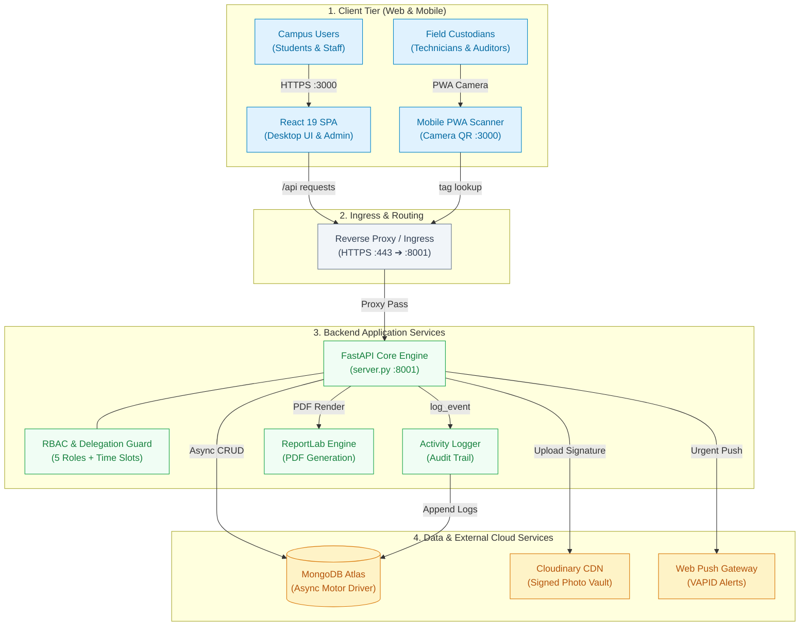
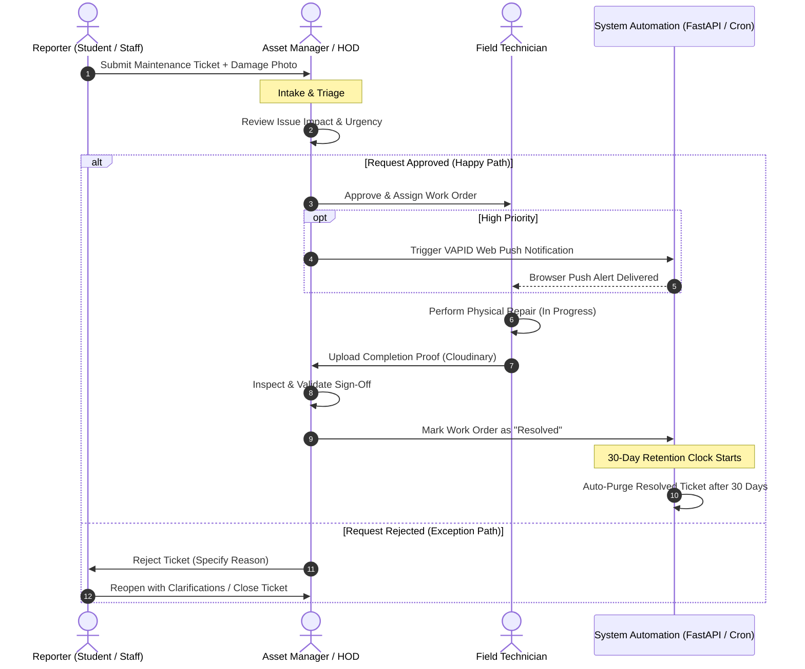
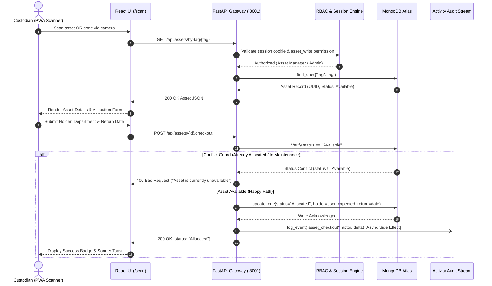
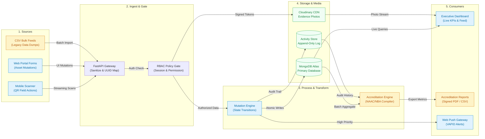
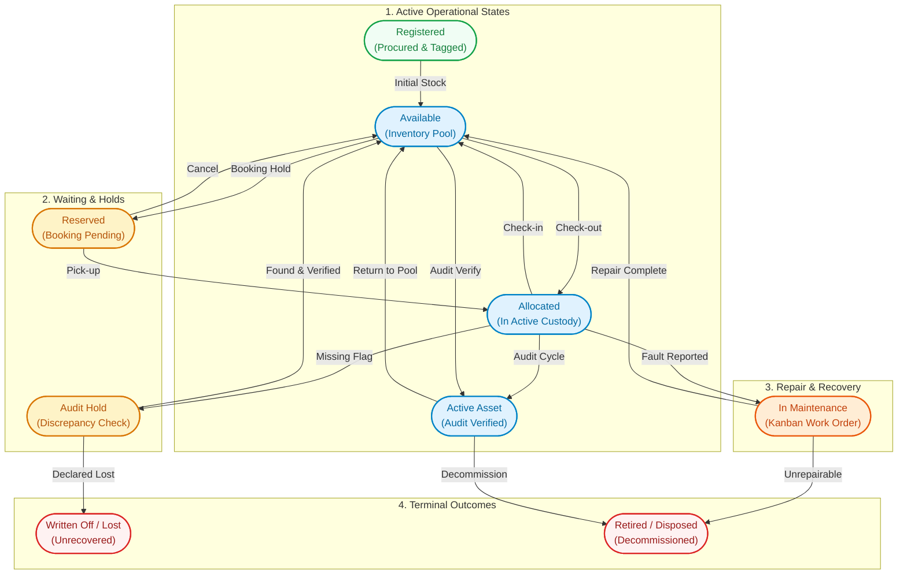

# AssetFlow Campus (CampusX)

**Every campus asset. Accountable. From one calm, unified workspace.**

AssetFlow Campus is an enterprise-grade campus asset lifecycle management platform designed specifically for colleges and universities. It tracks physical assets across their entire journey — procurement, tagging, allocation (check-out / check-in), room & equipment reservations, maintenance triage, periodic audit cycles, student no-dues clearance, and accreditation (NAAC / NBA) reporting — enforced by a strict, server-side Role-Based Access Control (RBAC) security model.

The platform provides a responsive desktop dashboard and mobile PWA workflow, featuring camera-based QR code scanning, a Trello-style drag-and-drop maintenance Kanban board with Cloudinary photo evidence, browser push notifications via VAPID Web Push, and signed ReportLab PDF/CSV compliance exports.

---

## 📋 Table of Contents

- [System Architecture & Archify Models](#-system-architecture--archify-models)
  - [1. High-Level Architecture Diagram (Architecture Mode)](#1-high-level-architecture-diagram-architecture-mode)
  - [2. Maintenance & Work Order Approval Workflow (Workflow Mode)](#2-maintenance--work-order-approval-workflow-workflow-mode)
  - [3. QR-Based Asset Allocation Sequence (Sequence Mode)](#3-qr-based-asset-allocation-sequence-sequence-mode)
  - [4. Asset & Accreditation Data Journey (Dataflow Mode)](#4-asset--accreditation-data-journey-dataflow-mode)
  - [5. Campus Physical Asset Lifecycle (Lifecycle Mode)](#5-campus-physical-asset-lifecycle-lifecycle-mode)
  - [Interactive Archify Showcase Suite](#interactive-archify-showcase-suite)
- [Tech Stack](#-tech-stack)
- [Repository Layout](#-repository-layout)
- [Core Features](#-core-features)
- [Roles & Access Control (RBAC)](#-roles--access-control-rbac)
- [Demo Dataset & Seeding](#-demo-dataset--seeding)
- [Local Development Setup](#-local-development-setup)
- [External Services Configuration](#-external-services-configuration)
- [Environment Variables](#-environment-variables)
- [Demo Accounts](#-demo-accounts)
- [Development Workflow & Testing](#-development-workflow--testing)
- [Production Deployment](#-production-deployment)
- [Documentation & Support](#-documentation--support)

---

## 🏛 System Architecture & Archify Models

AssetFlow Campus is modeled using **Archify** across 5 distinct architectural perspectives. Each model is compiled into both an interactive showcase viewer (`docs/architecture/*.html`) and rendered natively below via GitHub-compatible Mermaid diagrams.

```
docs/architecture/
├── system-architecture.architecture.json  ──▶  system-architecture.html   (High-level System Architecture)
├── maintenance-workflow.workflow.json    ──▶  maintenance-workflow.html  (Work Order & Approval Workflow)
├── qr-checkout.sequence.json             ──▶  qr-checkout.html           (QR Scan & Allocation Sequence)
├── asset-dataflow.dataflow.json           ──▶  asset-dataflow.html         (Data Ingestion & Accreditation Flow)
└── asset-lifecycle.lifecycle.json         ──▶  asset-lifecycle.html        (Physical Asset State Transitions)
```

---

### 1. High-Level Architecture Diagram (Architecture Mode)

- **Interactive Showcase File**: [docs/architecture/system-architecture.html](file:///d:/projects/CampusX/docs/architecture/system-architecture.html)
- **Specification Source**: [docs/architecture/system-architecture.architecture.json](file:///d:/projects/CampusX/docs/architecture/system-architecture.architecture.json)
- **Scope**: 8–12 core components across Client Tier, Backend Application Services, and Managed Cloud Infrastructure.
- **Primary Path**: Client requests traverse Ingress (`:443`) into the FastAPI Application (`:8001`), undergo RBAC validation, commit mutations to MongoDB Atlas, and emit immutable audit records to the Activity Logger.



---

### 2. Maintenance & Work Order Approval Workflow (Workflow Mode)

- **Interactive Showcase File**: [docs/architecture/maintenance-workflow.html](file:///d:/projects/CampusX/docs/architecture/maintenance-workflow.html)
- **Specification Source**: [docs/architecture/maintenance-workflow.workflow.json](file:///d:/projects/CampusX/docs/architecture/maintenance-workflow.workflow.json)
- **Actors / Lanes**: Reporter (Student/Staff), Asset Manager / HOD, Field Technician, System Automation.
- **Workflow Highlights**:
  - **Happy Path**: Report Issue ➔ Manager Triage ➔ Approval Gate ➔ Technician Repair ➔ Photo Evidence Attachment ➔ Manager Sign-Off ➔ Move to Resolved ➔ 30-Day Auto-Purge.
  - **Exception Path**: Rejected work orders are logged with reasons and retained for re-evaluation or admin deletion.
  - **Automated Lifecycle**: High-priority work orders trigger instant browser Web Push notifications; resolved orders are automatically purged after 30 days.



---

### 3. QR-Based Asset Allocation Sequence (Sequence Mode)

- **Interactive Showcase File**: [docs/architecture/qr-checkout.html](file:///d:/projects/CampusX/docs/architecture/qr-checkout.html)
- **Specification Source**: [docs/architecture/qr-checkout.sequence.json](file:///d:/projects/CampusX/docs/architecture/qr-checkout.sequence.json)
- **Interaction Highlights**: Custodian scans asset barcode/QR tag in field ➔ Frontend queries asset metadata ➔ Backend verifies session token and `asset_write` permission ➔ Conflict validation prevents double allocation ➔ Asset state flips to `Allocated` ➔ Non-blocking activity event logged to audit stream.



---

### 4. Asset & Accreditation Data Journey (Dataflow Mode)

- **Interactive Showcase File**: [docs/architecture/asset-dataflow.html](file:///d:/projects/CampusX/docs/architecture/asset-dataflow.html)
- **Specification Source**: [docs/architecture/asset-dataflow.dataflow.json](file:///d:/projects/CampusX/docs/architecture/asset-dataflow.dataflow.json)
- **Data Lifecycle**: Maps ingestion from real-time and batch sources through processing gates into storage repositories and downstream consumers.
- **Streaming vs. Batch Distinction**:
  - **Streaming / Real-Time**: Field QR scans, check-out/in events, and Kanban drag-and-drop state changes stream instantly to MongoDB and the Activity Log.
  - **Batch Operations**: Bulk CSV asset/user imports, NAAC/NBA accreditation indicator aggregation, and Weekly Digest generation run as scheduled or on-demand batch operations.



---

### 5. Campus Physical Asset Lifecycle (Lifecycle Mode)

- **Interactive Showcase File**: [docs/architecture/asset-lifecycle.html](file:///d:/projects/CampusX/docs/architecture/asset-lifecycle.html)
- **Specification Source**: [docs/architecture/asset-lifecycle.lifecycle.json](file:///d:/projects/CampusX/docs/architecture/asset-lifecycle.lifecycle.json)
- **State Taxonomy**:
  - **Active Operational States**: `Registered` ➔ `Available` ➔ `Allocated` ➔ `In Maintenance` ➔ `Active Asset (Verified)`.
  - **Wait / Holding States**: `Reserved` (pending reservation pickup) and `Audit Hold` (unlocated/discrepancy investigation).
  - **Recovery Loop**: Assets damaged during allocation enter `In Maintenance` and return to `Available` upon manager sign-off.
  - **Explicit Terminal States**: Unaccounted assets end as `Written Off / Lost`; end-of-life equipment ends as `Retired / Disposed`.



---

### Interactive Archify Showcase Suite

To inspect or demonstrate the Archify diagrams in an interactive browser canvas with pan/zoom, coordinate tracking, and visual review tooling:

```bash
# View any diagram locally in your default browser:
start docs/architecture/system-architecture.html
start docs/architecture/maintenance-workflow.html
start docs/architecture/qr-checkout.html
start docs/architecture/asset-dataflow.html
start docs/architecture/asset-lifecycle.html

# Re-render or compile changes using the Archify CLI:
node "C:\Users\ASUS\.agents\skills\archify\bin\archify.mjs" render architecture docs/architecture/system-architecture.architecture.json docs/architecture/system-architecture.html
node "C:\Users\ASUS\.agents\skills\archify\bin\archify.mjs" render workflow docs/architecture/maintenance-workflow.workflow.json docs/architecture/maintenance-workflow.html
node "C:\Users\ASUS\.agents\skills\archify\bin\archify.mjs" render sequence docs/architecture/qr-checkout.sequence.json docs/architecture/qr-checkout.html
node "C:\Users\ASUS\.agents\skills\archify\bin\archify.mjs" render dataflow docs/architecture/asset-dataflow.dataflow.json docs/architecture/asset-dataflow.html
node "C:\Users\ASUS\.agents\skills\archify\bin\archify.mjs" render lifecycle docs/architecture/asset-lifecycle.lifecycle.json docs/architecture/asset-lifecycle.html
```

---

## 🛠 Tech Stack

| Layer | Technology | Details |
|---|---|---|
| **Frontend Framework** | React 19, React Router 7 | Single-page application architecture with CRACO build tooling |
| **Styling & Design System** | Tailwind CSS, shadcn/ui, Radix UI | Dark/light mode via `next-themes`, 40+ modular UI components, Geist design tokens |
| **Visuals & Motion** | Framer Motion, Recharts, Lucide Icons | Smooth page transitions, executive KPI graphs, OrbitTrails canvas effects |
| **Drag & Drop** | `@hello-pangea/dnd` | Accessible Kanban board for maintenance work order triage |
| **QR Code Engine** | `html5-qrcode` & `qrcode.react` | Browser camera barcode scanner and dynamic SVG QR code generator |
| **Feedback & Notifications** | Sonner, Web Push API (`pywebpush`) | Action toasts and real-time browser push notifications |
| **Backend Framework** | FastAPI (Python 3.11), Uvicorn | High-performance asynchronous REST API architecture |
| **Database & ODM** | MongoDB Atlas, Motor | Asynchronous MongoDB driver with UUID primary keys (`_id` stripped) |
| **Data Validation** | Pydantic v2 | Strict schema validation with non-blank whitespace validators |
| **Security & Auth** | bcrypt, HTTP-only Cookies, Google OAuth | Cookie session tokens + Emergent Google OAuth token verification |
| **File Storage** | Cloudinary | Cryptographically signed direct uploads for damage evidence & branding |
| **Document Generation** | ReportLab 5.0.0 | Server-side vector PDF generation for NAAC/NBA and Weekly Digest reports |
| **Process Management** | Supervisor, Kubernetes Ingress | Automated daemon management (`:3000` frontend, `:8001` backend) |

---

## 📁 Repository Layout

```
CampusX/
├── docs/                                  # Architectural models & diagrams
│   └── architecture/
│       ├── system-architecture.architecture.json # Archify architecture specification
│       ├── system-architecture.html              # Compiled interactive architecture viewer
│       ├── maintenance-workflow.workflow.json    # Archify workflow specification
│       ├── maintenance-workflow.html             # Compiled interactive workflow viewer
│       ├── qr-checkout.sequence.json             # Archify sequence specification
│       ├── qr-checkout.html                      # Compiled interactive sequence viewer
│       ├── asset-dataflow.dataflow.json          # Archify dataflow specification
│       ├── asset-dataflow.html                   # Compiled interactive dataflow viewer
│       ├── asset-lifecycle.lifecycle.json        # Archify lifecycle specification
│       └── asset-lifecycle.html                 # Compiled interactive lifecycle viewer
├── backend/                               # FastAPI backend service
│   ├── server.py                          # Unified API: 50+ routes, RBAC, Cloudinary, PDF, Push
│   ├── seed_data.py                       # Realistic 260-asset campus demonstration dataset
│   ├── requirements.txt                   # Python dependencies (FastAPI, Motor, ReportLab, etc.)
│   ├── pytest.ini                         # Pytest configuration and test path flags
│   ├── .env.example                       # Template for backend environment variables
│   ├── tests/                             # Comprehensive automated backend test suite
│   │   ├── test_assetflow_api.py          # Core API, RBAC, and mutation test suite
│   │   └── test_new_features.py           # Verification tests for QR, push, and digest
│   └── README.md                          # Dedicated backend technical documentation
├── frontend/                              # React 19 single-page application
│   ├── src/
│   │   ├── App.js                         # Core application: routing, Shell, and 13 pages
│   │   ├── index.js                       # React root bootstrap, providers, and toaster
│   │   ├── App.css / index.css            # Global styling, Geist variables, and animations
│   │   ├── components/                    # Modular React components
│   │   │   ├── OrbitTrails.jsx            # Dynamic background canvas animation
│   │   │   └── ui/                        # 40+ shadcn/ui components (Dialog, Tabs, Button, etc.)
│   │   ├── hooks/                         # Custom React hooks (useToast, etc.)
│   │   ├── lib/                           # Utility helpers (cn class merge, formatting)
│   │   └── constants/                     # Test IDs and automation selectors
│   ├── public/                            # Static assets, PWA manifest, and service worker
│   │   ├── index.html                     # HTML root with PWA viewport and meta tags
│   │   └── sw.js                          # Service worker for Web Push notification handling
│   ├── plugins/                           # Build plugins (health checks, dev server aids)
│   ├── craco.config.js                    # CRACO configuration for aliases and Tailwind
│   ├── tailwind.config.js                 # Tailwind CSS theme and color tokens
│   ├── package.json                       # Frontend dependencies and npm scripts
│   ├── .env.example                       # Template for frontend environment variables
│   └── README.md                          # Dedicated frontend technical documentation
├── memory/                                # Product design specifications
│   ├── PRD.md                             # Product Requirements Document
│   └── wireframes.html                    # Visual wireframes and UI architecture specifications
├── .devin/                                # Agent execution configuration
├── auth_testing.md                        # Manual authentication testing verification checklist
├── design_guidelines.json                 # UI layout, typography, and color tokens
├── vercel.json                            # Vercel deployment and routing rules
├── zerops.yaml                            # Zerops multi-service deployment blueprint
└── README.md                              # Main platform documentation (this file)
```

---

## 🌟 Core Features

- **Executive KPI Dashboard (`/dashboard`)**: Instant metrics on total inventory, active allocations, open repairs, and campus asset utilization percentages alongside live activity feeds.
- **Master Asset Register (`/inventory`)**: Searchable, filterable catalog supporting category, department, operational condition, serial number, and bookable criteria.
- **Detailed Asset Profile (`/inventory/:id`)**: Comprehensive hardware specs, warranty expiration dates, AMC vendor data, dynamic QR code cards, and fast check-out/check-in modals.
- **Mobile QR Field Scanner (`/scan`)**: Touch-optimized (≥44px targets) PWA camera flow allowing custodians to scan physical tags to inspect, check out, or return assets on the spot.
- **Maintenance Kanban Board (`/maintenance`)**: Interactive drag-and-drop board (`@hello-pangea/dnd`) spanning *Open*, *In Progress*, *Resolved*, and *Rejected*. Features priority filters, damage photo uploads via Cloudinary, and **automatic 30-day purge for resolved tickets**.
- **Facility & Equipment Bookings (`/bookings`)**: Real-time calendar reservation system for campus labs, conference halls, projectors, laptops, and transit buses with conflict prevention.
- **Periodic Physical Audits (`/audits`)**: Audit cycle manager enabling field auditors to verify equipment condition (`Verified`, `Missing`, `Damaged`), attach photo evidence, and export signed closure PDFs.
- **Student No-Dues Clearance (`/nodues`)**: Multi-department clearance dashboard (Library, Hostel, Sports, Laboratory, Accounts) allowing administrators to track and update student exit clearance status.
- **Accreditation & Operational Reports (`/reports`)**: Generates NAAC/NBA criteria compliance reports with downloadable signed PDF and CSV exports incorporating custom institutional cover sheets.
- **Executive Monday Digest (`/digest`)**: Print-ready administrative briefing compiling open work orders, pending account approvals, weekly booking calendars, and open audit runs.
- **Centralized Admin Console (`/admin`)**: Manage departments, asset categories, user roles, CSV bulk imports, temporary Admin delegation windows, custom report templates, and institutional branding.
- **Activity & Compliance Audit Log (`/activity`)**: Immutable 300+ event chronological ledger capturing every mutation, user, actor, and state delta across the workspace.

---

## 👥 Roles & Access Control (RBAC)

Security is enforced **server-side** on every protected route via FastAPI dependencies (`require_permission`). The frontend mirrors these permissions to dynamically adapt navigation and actionable controls.

| Role | Description | Allowed Permissions |
|---|---|---|
| **Admin** | Full system governance, security, and institutional configuration | `admin`, `asset_write`, `maintenance_write`, `booking`, `audit`, `nodues`, `reports` |
| **Asset Manager** | Operational custodian managing inventory, allocations, and audits | `asset_write`, `maintenance_write`, `booking`, `audit`, `reports` |
| **HOD** | Department Head managing departmental assets and approving repairs | `asset_write`, `maintenance_write`, `booking`, `reports` |
| **Employee** | Faculty and campus staff reserving resources and reporting issues | `maintenance_write`, `booking`, `reports` |
| **Student** | Campus learners booking student resources and reporting faults | `booking`, `maintenance_write` |

### Dynamic Admin Delegation Slots
Administrators can temporarily grant **Admin** privileges to a deputy (e.g., during leave or inspection cycles) for a specific time window (`[start_at, end_at]`). The backend evaluates delegation records dynamically upon every request; elevated privileges activate automatically at the start timestamp and expire when the window closes without requiring database migrations.

---

## 📊 Demo Dataset & Seeding

The platform includes a realistic, pre-configured campus dataset in `backend/seed_data.py`. When launched against a fresh database, it automatically populates:

- **260 Assets**: Spanning 15 academic and operational departments and 10 categories (Computing, Lab Instruments, AV Equipment, Furniture, Vehicles, etc.) across all operational states (`Available`, `Allocated`, `Under Maintenance`, `Lost`, `Retired`).
- **50 Maintenance Requests**: Realistic work orders across `Low`, `Medium`, and `High` priorities with fault descriptions and technician logs.
- **45 Resource Bookings**: Past, current, and upcoming reservations for seminar halls, 3D printers, oscilloscopes, and campus transit.
- **12 Audit Cycles**: 5 Open cycles and 7 Closed cycles with item-level verifications and evidence attachments.
- **35 Student No-Dues Records**: Multi-department student clearance portfolios across Library, Hostels, Sports, and Accounts.
- **300 Activity Records**: Chronological 30-day immutable audit trail.
- **28 Demo Users**: Representative accounts across all five roles.

### Managing Seed Data
```bash
# Run seed script directly from the backend directory:
cd backend
python seed_data.py

# Keep existing data without wiping collections:
python seed_data.py --keep
```
*Note: Administrators can also reset and repopulate the complete demonstration dataset directly from the Admin Console UI (`/admin`) via the "Reset & Repopulate Full Demo Dataset" button.*

---

## 💻 Local Development Setup

### Prerequisites
- **Node.js** (v18 or higher)
- **Python** (v3.11 recommended)
- **MongoDB** (Local instance or MongoDB Atlas cluster URI)
- **Yarn** or **npm**

### 1. Clone & Prepare
```bash
git clone <repository-url>
cd CampusX
```

### 2. Backend Setup
```bash
cd backend

# Create and activate virtual environment
python -m venv venv
# Windows:
venv\Scripts\activate
# macOS/Linux:
source venv/bin/activate

# Install dependencies
pip install -r requirements.txt

# Configure environment
cp .env.example .env
# Edit backend/.env with your MongoDB Atlas and API credentials

# Start FastAPI server
uvicorn server:app --reload --host 0.0.0.0 --port 8001
```
*The backend API will be live at `http://localhost:8001/api`.*

### 3. Frontend Setup
```bash
cd ../frontend

# Install dependencies
yarn install
# or: npm install

# Configure environment
cp .env.example .env
# Ensure REACT_APP_BACKEND_URL=http://localhost:8001

# Start React development server
yarn start
# or: npm start
```
*The frontend client will open automatically at `http://localhost:3000`.*

---

## 🔌 External Services Configuration

### 1. MongoDB Atlas
1. Create a cluster at [MongoDB Atlas](https://www.mongodb.com/cloud/atlas).
2. Under **Network Access**, add your server/development IP.
3. Under **Database Access**, create a user with read/write permissions.
4. Copy the connection string and set `MONGO_URL` in `backend/.env`.

### 2. Cloudinary (Evidence Photos & Logos)
1. Register a free account at [Cloudinary](https://cloudinary.com/).
2. From the Console Dashboard, copy your **Cloud Name**, **API Key**, and **API Secret**.
3. Update `CLOUDINARY_*` variables in `backend/.env`. Client uploads request a short-lived HMAC signature from `GET /api/uploads/signature` and transmit directly to Cloudinary.

### 3. Google OAuth
1. Open the [Google Cloud Console](https://console.cloud.google.com/) and create a project.
2. Configure the OAuth Consent Screen and create an **OAuth 2.0 Client ID (Web Application)**.
3. Add your authorized Javascript origins (`http://localhost:3000`) and redirect URIs.
4. Set `GOOGLE_CLIENT_ID` in `backend/.env` and `REACT_APP_GOOGLE_CLIENT_ID` in `frontend/.env`.

### 4. Web Push Notifications (VAPID)
1. Generate a cryptographic VAPID key pair:
   ```bash
   npx web-push generate-vapid-keys
   ```
2. Populate `VAPID_PUBLIC_KEY`, `VAPID_PRIVATE_KEY`, and `VAPID_SUBJECT` in `backend/.env`.

---

## 🔐 Environment Variables

### Backend (`backend/.env`)
```env
# Database
MONGO_URL=mongodb+srv://<username>:<password>@cluster.mongodb.net/?retryWrites=true&w=majority
DB_NAME=assetflow_campus

# Cross-Origin Resource Sharing
CORS_ORIGINS=http://localhost:3000,http://127.0.0.1:3000

# Cloudinary Storage
CLOUDINARY_CLOUD_NAME=your_cloud_name
CLOUDINARY_API_KEY=your_api_key
CLOUDINARY_API_SECRET=your_api_secret

# Web Push (VAPID)
VAPID_PUBLIC_KEY=your_vapid_public_key
VAPID_PRIVATE_KEY=your_vapid_private_key
VAPID_SUBJECT=mailto:admin@yourcampus.edu

# Google Authentication
GOOGLE_CLIENT_ID=your_google_client_id.apps.googleusercontent.com
```

### Frontend (`frontend/.env`)
```env
# Backend API Base URL
REACT_APP_BACKEND_URL=http://localhost:8001

# Google OAuth Client
REACT_APP_GOOGLE_CLIENT_ID=your_google_client_id.apps.googleusercontent.com
```

---

## 👤 Demo Accounts

The following seeded accounts are available immediately for local development and testing:

| Role | Email | Password | Access Capabilities |
|---|---|---|---|
| **Admin** | `admin@assetflow.edu` | `Admin123!` | Complete governance, role management, delegations, branding |
| **Asset Manager** | `demo@assetflow.edu` | `Campus123!` | Asset mutations, QR allocations, audits, maintenance triage |
| **HOD** | `hod.cs@assetflow.edu` | `Campus123!` | Departmental inventory review, repair approvals, reports |
| **Employee** | `prof.sharma@assetflow.edu` | `Campus123!` | Resource bookings, maintenance fault reporting |
| **Student** | `student.rahul@assetflow.edu` | `Campus123!` | Student equipment booking, repair reporting |

---

## 🧪 Development Workflow & Testing

### Automated Backend Tests
The backend test suite verifies endpoint security, RBAC enforcement, session management, and state mutations:

```bash
cd backend

# Run all test suites
pytest

# Run tests with verbose output
pytest -v

# Run targeted test suites
pytest tests/test_assetflow_api.py
pytest tests/test_new_features.py
```

### Frontend Code Quality
```bash
cd frontend

# Run frontend tests
yarn test --watchAll=false

# Lint and check style
yarn lint
```

---

## 🚀 Production Deployment

### Zerops Deployment (`zerops.yaml`)
AssetFlow Campus is configured for native cloud deployment using Zerops. The repository includes a production-ready `zerops.yaml` configuration defining:
- Node.js runtime for the React 19 frontend
- Python 3.11 runtime for the FastAPI backend service
- Automated build, dependency caching, and process restart policies

### Supervisor Process Daemon (Ubuntu / Debian)
When running on dedicated Linux servers or virtual machines:
```ini
[program:campusx-backend]
command=/var/www/CampusX/backend/venv/bin/uvicorn server:app --host 0.0.0.0 --port 8001
directory=/var/www/CampusX/backend
autostart=true
autorestart=true
stderr_logfile=/var/log/campusx-backend.err.log
stdout_logfile=/var/log/campusx-backend.out.log

[program:campusx-frontend]
command=yarn serve -s build -l 3000
directory=/var/www/CampusX/frontend
autostart=true
autorestart=true
stderr_logfile=/var/log/campusx-frontend.err.log
stdout_logfile=/var/log/campusx-frontend.out.log
```

---

## 📚 Documentation & Support

- **[backend/README.md](backend/README.md)** — In-depth API endpoint specifications, Pydantic schemas, and database collection models.
- **[frontend/README.md](frontend/README.md)** — Frontend routing structure, state management, PWA service worker details, and component guide.
- **[docs/architecture/](docs/architecture/)** — Archify specification files (`.json`) and compiled interactive viewers (`.html`).
- **[memory/PRD.md](memory/PRD.md)** — Product Requirements Document and historical changelog.
- **[auth_testing.md](auth_testing.md)** — Step-by-step authentication and session validation checklist.

---

**Built with ❤️ for educational institutions and campus administrators.**
